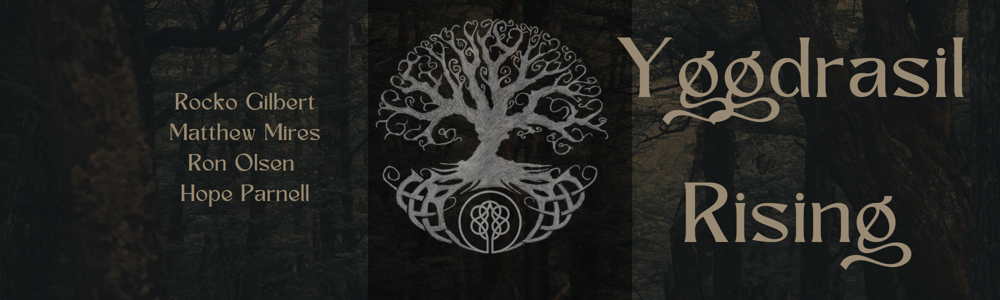

<!-- @format -->

# YggdrasilRising

## 

## Description

There's nothing cooler than building a tree house. That is your goal in this VR
game. You will explore the world and the various areas surrounding Yggdrasil,
The Legendary World Tree, as you venture to make it the home of the biggest,
most powerful, epic treehouse of all time. Climb up your very own Yggdrasil and
find support in its mighty limbs to build your foundation so that you may
finally begin building the greatest treehouse of all time.

In the future we would like to implement many new challenges and features,
including being in explosive battles with other mighty trees!

## Installation

1. Download the SDK from
   [here](https://developer.oculus.com/downloads/package/oculus-sdk-for-windows/).
2. login to the companion website and look around.

## Credits

"Hymn To The Gods" by Alexander Nakarada | https://www.serpentsoundstudios.com \
Music promoted by https://www.free-stock-music.com \
Attribution 4.0 International (CC BY 4.0) \
https://creativecommons.org/licenses/by/4.0/

"Celtic Love" by Twisterium | https://www.twisterium.com \
Music promoted by https://www.free-stock-music.com \
Creative Commons Attribution-ShareAlike 3.0 Unported \
https://creativecommons.org/licenses/by-sa/3.0/deed.en_US

"Untouched Land" by Alexander Nakarada | https://www.serpentsoundstudios.com \
Music promoted by https://www.free-stock-music.com \
Attribution 4.0 International (CC BY 4.0) \
https://creativecommons.org/licenses/by/4.0/

Licensed under the [MIT License](LICENSE).

Authors:

- [x] [Rocko Gilbert](https://github.com/rockogilbert)
- [x] [Matthew Mires](https://github.com/mutantEris)
- [x] [Ron Olsen](https://github.com/ronroeandassociates)
- [x] [Hope Parnell](https://github.com/Hope-Parnell)
